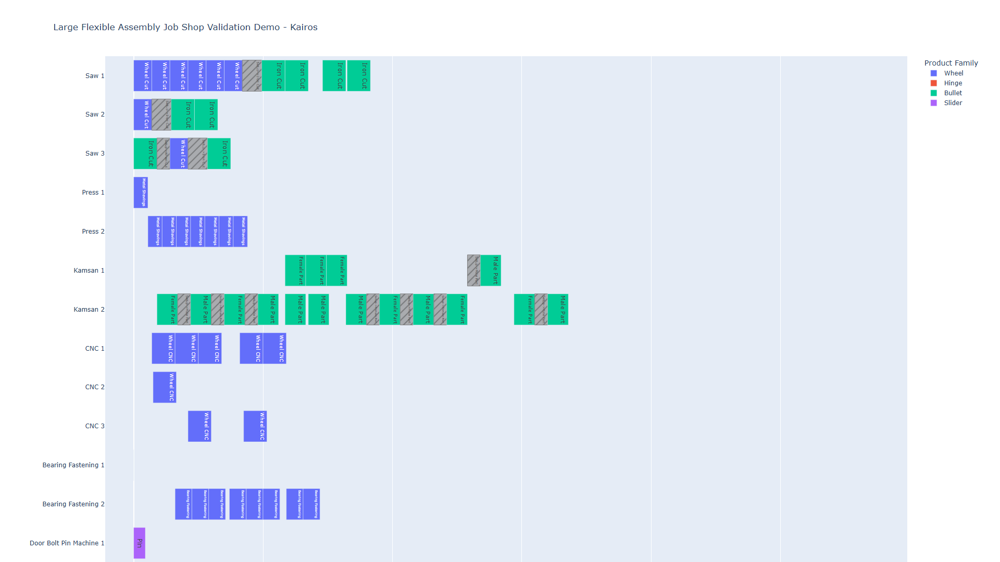
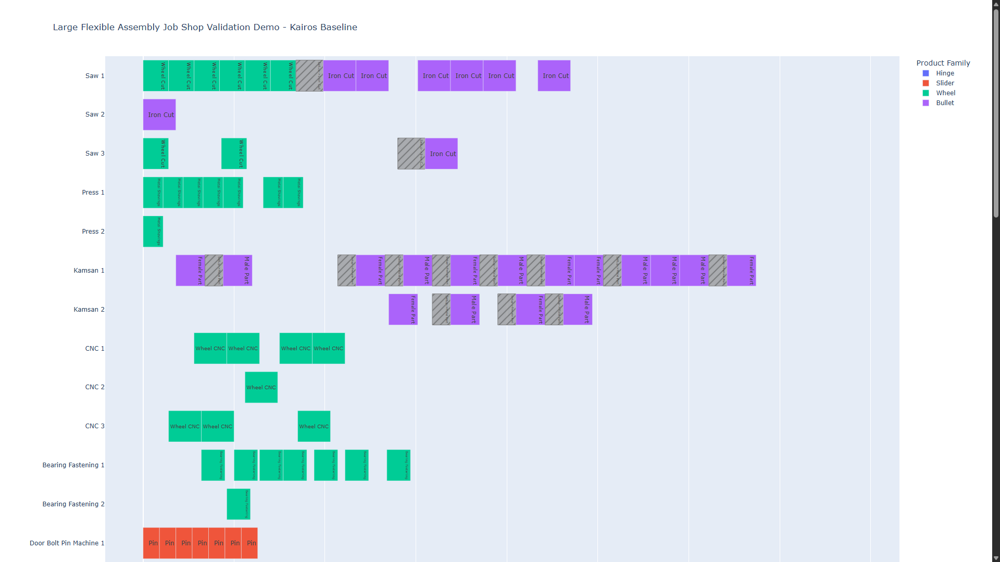
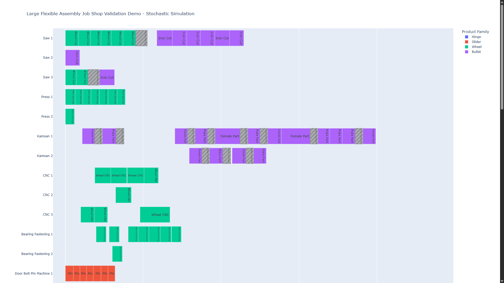

# Kairos: Production Scheduling and Simulation

Kairos is a design project for industrial flexible assembly job-shop scheduling and schedule validation. It combines constraint programming with discrete-event simulation: the scheduler creates a production plan, the simulator executes that plan under deterministic or stochastic conditions, and the validation layer measures whether the plan remains feasible.

## System workflow

1. A production problem defines jobs, operations, precedence relations, alternative machines, processing times, release dates, due dates, priorities, and setup requirements.
2. The Kairos scheduler assigns operations to machines and times using Google OR-Tools CP-SAT or a selectable scheduling heuristic.
3. The adapter converts the optimized schedule into machines, batches, routes, calendars, and simulation events.
4. The SimPy engine replays the plan with deterministic durations or introduces stochastic processing times, transport delays, shift pauses, and failures.
5. The validation and visualization layers compare planned and actual execution and generate interactive Gantt charts.

## Main components

| Section | Purpose |
|---|---|
| `kairos/domain/` | Defines machines, jobs, tasks, alternative resources, precedence relations, objectives, and solution results. |
| `kairos/solvers/google_cp.py` | Builds and solves the CP-SAT scheduling model, including machine assignment, no-overlap, precedence, setup-time, makespan, and tardiness constraints. |
| `kairos/solvers/heuristics/` | Implements SPT, LPT, EDD, WSPT, SRPT, and McNaughton scheduling methods for comparison with CP-SAT. |
| `kairos/data/` | Loads production problems from structured Excel workbooks. |
| `kairos/gui/` | Provides the Streamlit interface, notation parsing, and solver selection. |
| `kairos/visualization/` | Creates Plotly Gantt charts and dependency graphs for scheduling results. |
| `factory_sim/models.py` | Defines the simulation model: machines, batches, routes, calendars, failures, transfers, events, and result summaries. |
| `factory_sim/engine.py` | Runs the SimPy production model and records operation timing, downtime, idle time, setup time, batch completion, and leftovers. |
| `factory_sim/kairos_adapter.py` | Converts a Kairos solution into a simulation-ready schedule while preserving machine assignments and task dependencies. |
| `factory_sim/validator.py` | Compares planned and simulated operations and reports timing differences and exact matches. |
| `factory_sim/visualization.py` | Generates scheduler and simulation Gantt charts using the same machine-oriented layout. |
| `factory_sim/tracker.py` | Produces a readable lifecycle trace for each product batch. |
| `src/validation/` | Parses JSPLIB benchmarks and independently checks schedule feasibility, precedence, machine conflicts, and makespan. |
| `tests/` | Contains solver, model, heuristic, import, visualization, simulation, benchmark, and integration tests. |

## Demonstrations

### Deterministic validation — `kairos_validation_demo.py`

This demo builds a flexible assembly job shop with **35 machines, 32 jobs, and 200 operations**. It solves the scheduling problem, converts the resulting schedule into a simulation model, and replays it without randomness. Every simulated operation is then compared with its planned start, finish, and machine assignment.

Result from the included validation run:

| Metric | Result |
|---|---:|
| Solver status | FEASIBLE |
| Planned makespan | 567.0 |
| Simulated makespan | 567.0 |
| Makespan difference | 0.0 |
| Mismatched operations | 0 |
| Exact schedule match | True |

The exact match verifies the scheduler-to-simulator conversion and deterministic execution logic across the full 200-operation schedule.

### Stochastic validation — `kairos_stochastic_demo.py`

This demo starts from a fixed Kairos schedule and replaces deterministic execution assumptions with:

- task- and product-family-specific processing-time distributions;
- machine failure and repair profiles for saw, press, Kamsan, CNC, bearing, and welding resources;
- layout-based travel times between production stages;
- setup, calendar, pause, and completion-horizon handling.

It executes **100 replications** with different random seeds and exports operation-level, machine-level, batch-level, and replication-level results.

| Metric | Result |
|---|---:|
| Jobs completed in the reported run | 32 |
| Operations in the schedule | 200 |
| Replications | 100 |
| Deterministic Kairos baseline | 394.00 hours |
| Mean stochastic completion | 457.62 hours |
| Standard deviation | 18.92 hours |
| 95% confidence interval | 453.91–461.32 hours |
| Mean increase over the plan | 16.15% |
| Leftover jobs in the reported run | 0 |

The stochastic experiment shows that all jobs can finish while uncertainty still creates a measurable increase in completion time. Each experiment is evaluated against the fixed schedule used for that experiment.

## Gantt chart previews

GitHub displays the PNG previews below directly in the README.

### Deterministic validation

**Kairos planned schedule**



**Simulation replay**


### Stochastic validation

**Kairos baseline schedule**



**Stochastic simulation execution**



## Interactive HTML charts

The interactive Plotly versions are included in `docs/demos/`. GitHub shows HTML as source code rather than running it; clone or download the repository and open the comparison pages in a browser to interact with the charts.

- [Deterministic comparison page](docs/demos/large_schedule_comparison.html)
- [Stochastic comparison page](docs/demos/large_stochastic_comparison.html)

## Independent benchmark validation

| Validation | Result |
|---|---|
| JSPLIB / OR-Library `ft06` | The solver found the known optimal makespan of **55** for the 6-job, 6-machine benchmark. The independent feasibility checker found no precedence or machine-overlap violations. |
| Weighted tardiness | The solver selected the priority-sensitive sequence with weighted tardiness **3**; reversing the order produces weighted tardiness **20**. |
| Deterministic integration | A Kairos solution reproduced by the simulation has an exact match and a makespan difference of **0.0**. |

## Automated test coverage

The repository contains **137 explicit automated test functions**:

| Test area | Tests | Coverage |
|---|---:|---|
| Kairos scheduler | 112 | Domain models, CP-SAT solvers, solver compatibility, six heuristics, Excel loading, Gantt charts, and dependency graphs. |
| Factory simulation and integration | 25 | Deterministic execution, failures and resumptions, calendars, setup logic, transfers, baskets, multi-predecessor operations, leftovers, JSPLIB, weighted tardiness, and Kairos-to-simulation validation. |

Install the development dependency and run the complete suite with:

```bash
python -m pip install -e ".[dev]"
python -m pytest
```

## Getting started

Python 3.11 or newer is recommended.

```bash
git clone https://github.com/yzc0000/kairos-production-scheduling.git
cd kairos-production-scheduling
python -m venv .venv
```

Activate the virtual environment, then install the project:

```bash
python -m pip install -e .
```

Run the deterministic validation demo:

```bash
python examples/kairos_validation_demo.py --quiet-kairos
```

Run the stochastic validation demo:

```bash
python examples/kairos_stochastic_demo.py
```

## Repository structure

```text
kairos/            Scheduling models, solvers, import tools, GUI, and visualizations
factory_sim/       Discrete-event simulation, adapters, validation, and reporting
src/validation/    Independent JSPLIB parser and feasibility checker
examples/          Deterministic and stochastic end-to-end demonstrations
docs/demos/        Generated interactive Gantt charts
docs/images/       PNG previews displayed directly on GitHub
tests/             Kairos and factory-simulation automated tests
benchmarks/        Standard scheduling benchmark data
```

## Technology

Python, Google OR-Tools, SimPy, Plotly, Pandas, OpenPyXL, Streamlit, and pytest.


